## motivation

:::::::::::::: {.columns}
::::::::: {.column width="30%"}
:::::: {.r-stack}
::: {}
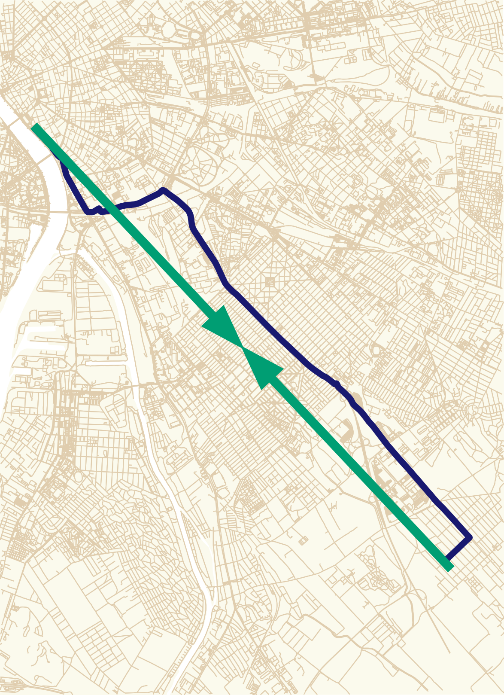
:::
::: {.fragment data-fragment-index=1}
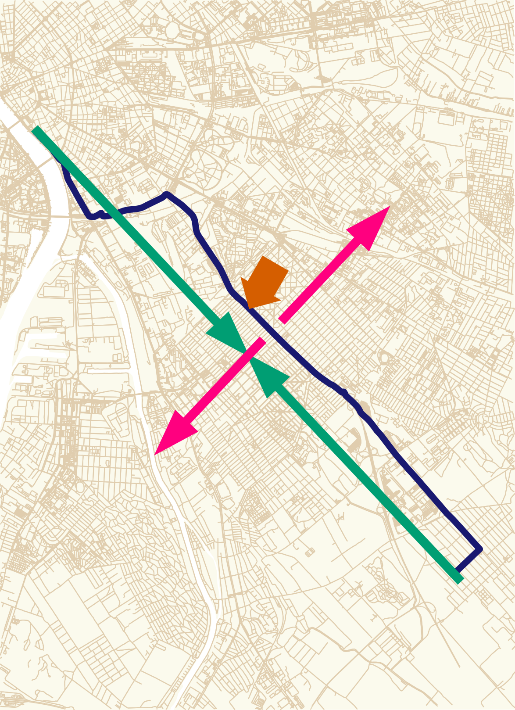
:::
::::::
:::::::::
::::::::: {.column width="80%"}
::: {.fragment data-fragment-index=1}
 via [Mapillary](https://www.mapillary.com/app/?lat=47.45252492224&lng=19.11784766168&z=17&pKey=1294650608077501&focus=photo) [CC BY-SA 4.0](https://creativecommons.org/licenses/by-sa/4.0/)](figures/vst_1294650608077501_20230915_cropped.jpg)
:::
<!-- :::::: -->
:::::::::
::::::::::::::

::: notes
- transportation infrastructure are built to connect places
- but the elements of this infrastructure can also separate neighborhoods
- especially if it is a wide, multilane road
- we can consider a road as a connecting and a separating element of the fabric of a city
- as if two orthogonal forces act regarding a road
:::

## motivation

:::::::::::::: {.columns}
::: {.column width="67%"}
 | [CC BY-SA 4.0](https://creativecommons.org/licenses/by-sa/4.0/)](figures/WildlifeCrossingRoad38IsraelOct092022_02.jpg){width=750}
:::
::::::::::::::

::: notes
- the barrier effect, the separating force 
- sometimes bridges solely for the wildlife are built to overcome this issue
- in an urban scenario, even a crosswalk, especially with traffic lamps could help
:::

## mobile positioning data

:::::::::::::: {.columns}
::: {.column width="55%"}
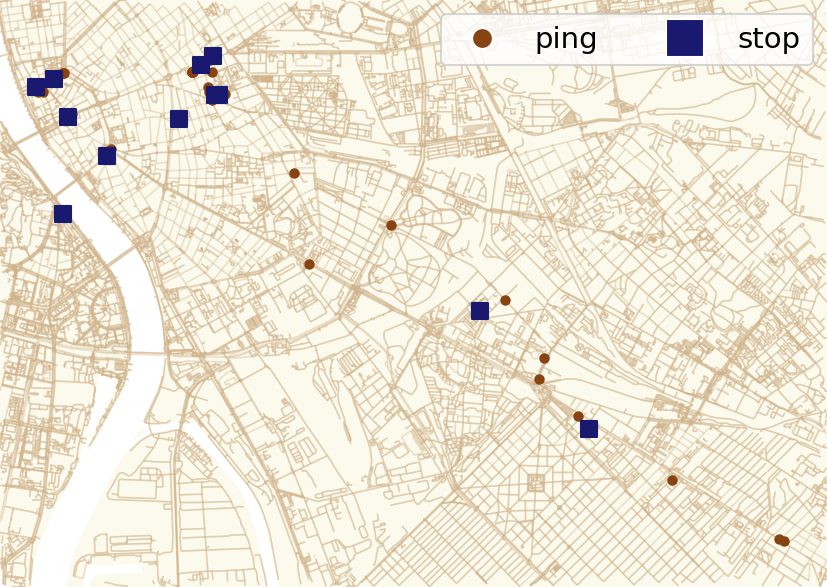{height=375}
:::
::: {.column width="45%" .text-smallerx .mt-5}
- collected from various, unspecified smartphone apps
    - timestamp, user ID, location
    - GPS-based location
- pings are clustered into stops [@juhasz2023amenity]
    - using [Infostop](https://github.com/ulfaslak/infostop) algorithm [@aslak2020infostop]
    - where some time was spent
:::
::::::::::::::

::: notes
- the mobility data is collected and aggregated from various and unknown smartphone applications
- a record has a timestamp, a user ID and GPS location
- we have two years of data for the whole country
:::

## building a network

:::::::::::::: {.columns}
::: {.column width="50%"}
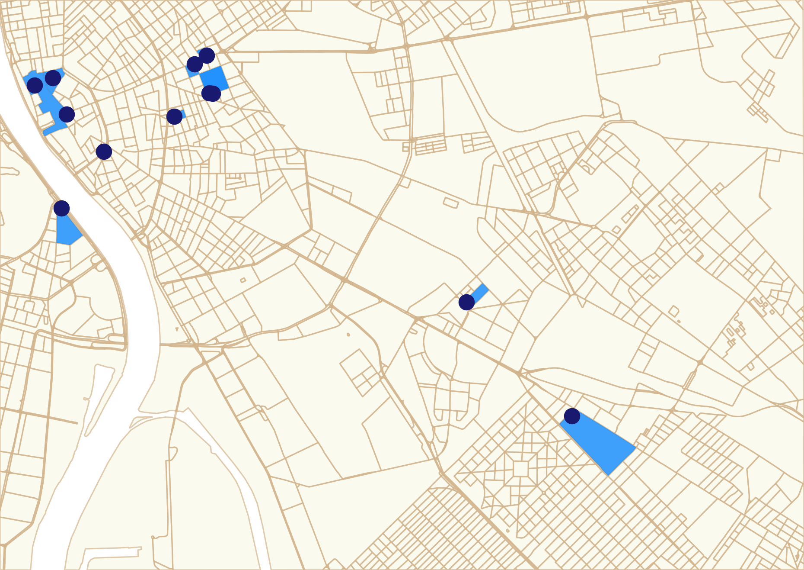
:::
::: {.column width="50%"}
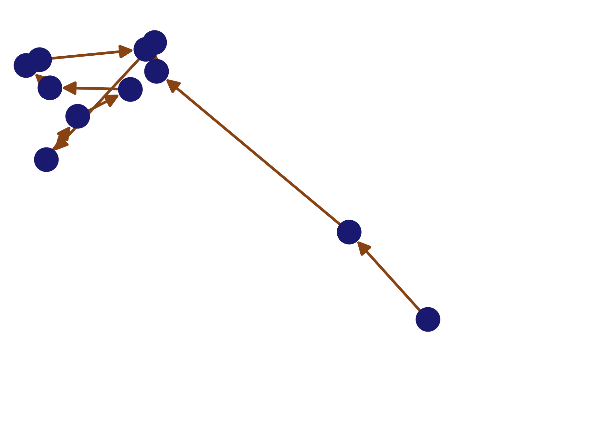
:::
::::::::::::::

## community detection

:::::::::::::: {.columns}
:::::: {.column .center-content width="55%"}
- using the network built from the stops
- Louvain community detection is applied
    - with different resolution values
    - executed 10 times for each resolution
::::::
:::::: {.column width="45%"}
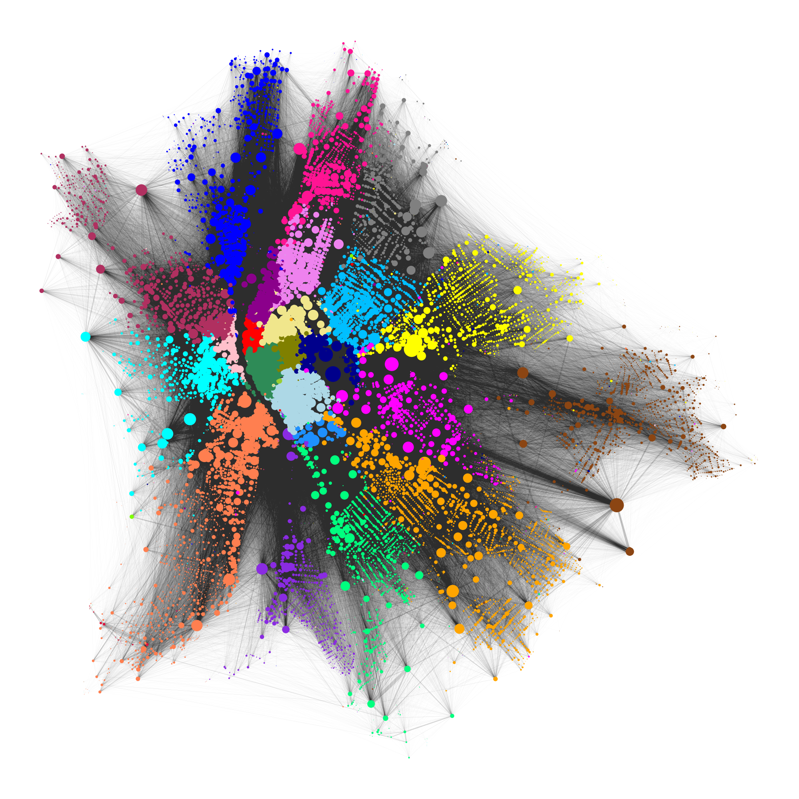
::::::
::::::::::::::

## Louvain community detection - resolution 2.5

:::::::::::::: {.columns}
:::::: {.column width="40%"}
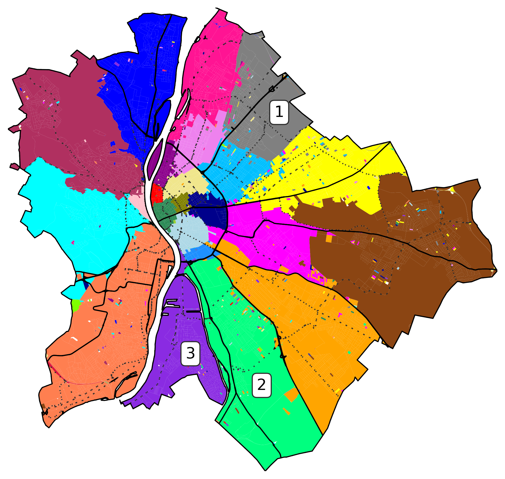
::::::
:::::: {.column width="40%"}
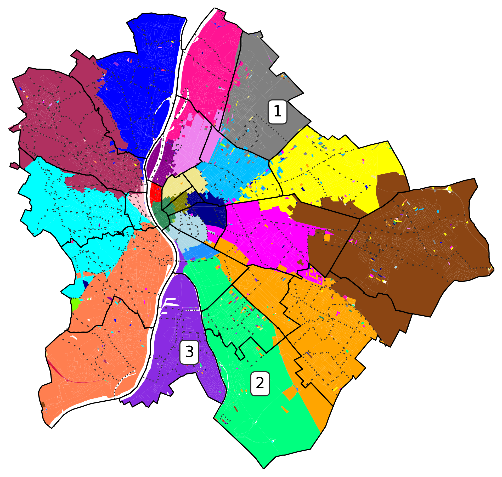
::::::
::::::::::::::

## barrier crossing ratio

::::::::::::::: {.columns}
:::::::::::: {.column width="50%"}
::::::::: {.r-stack}
:::::: {}
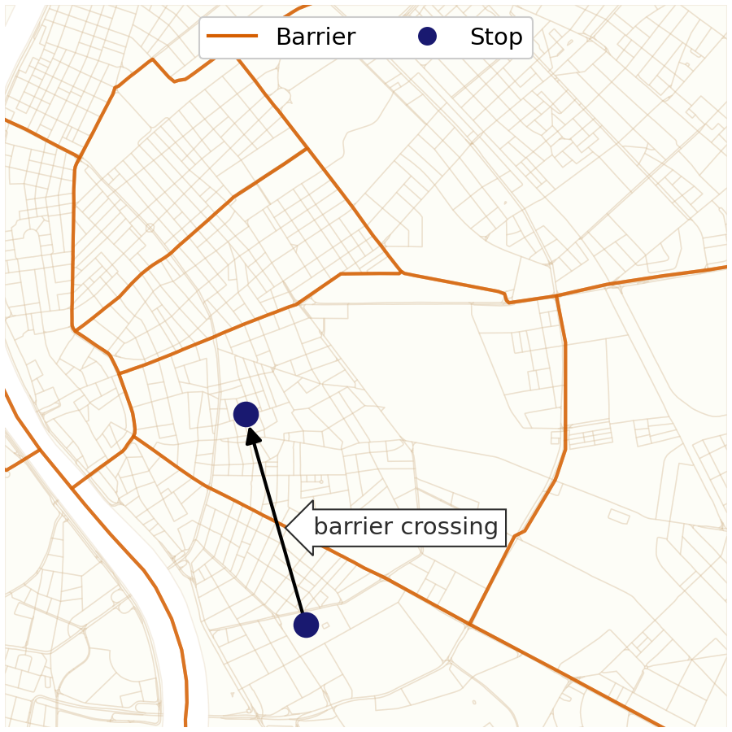
::::::
:::::: {.fragment data-fragment-index=1}
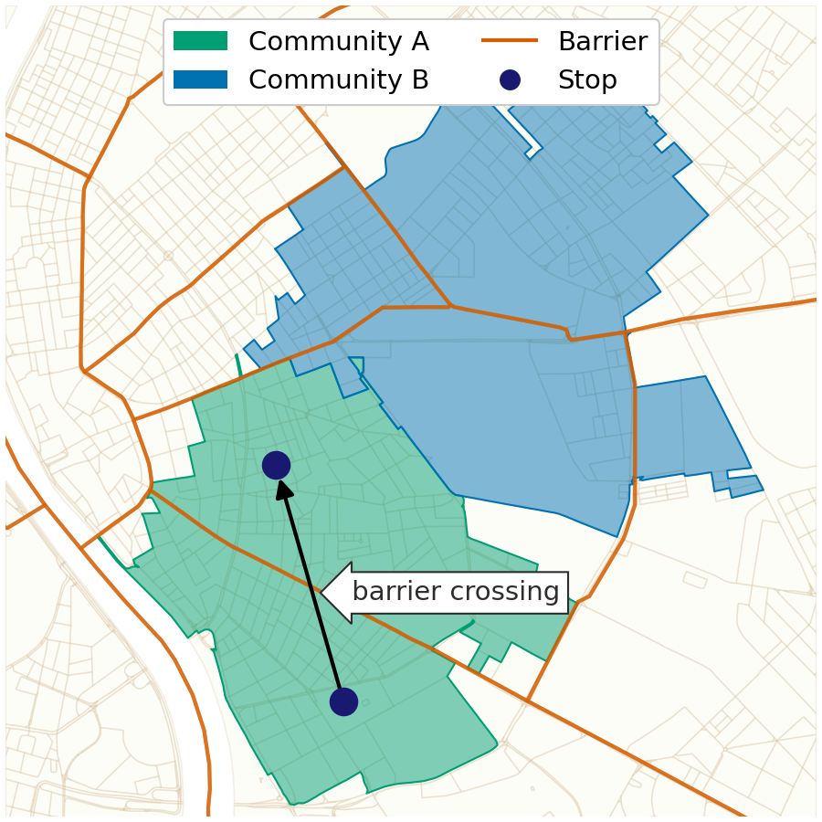
::::::
:::::: {.fragment data-fragment-index=2}
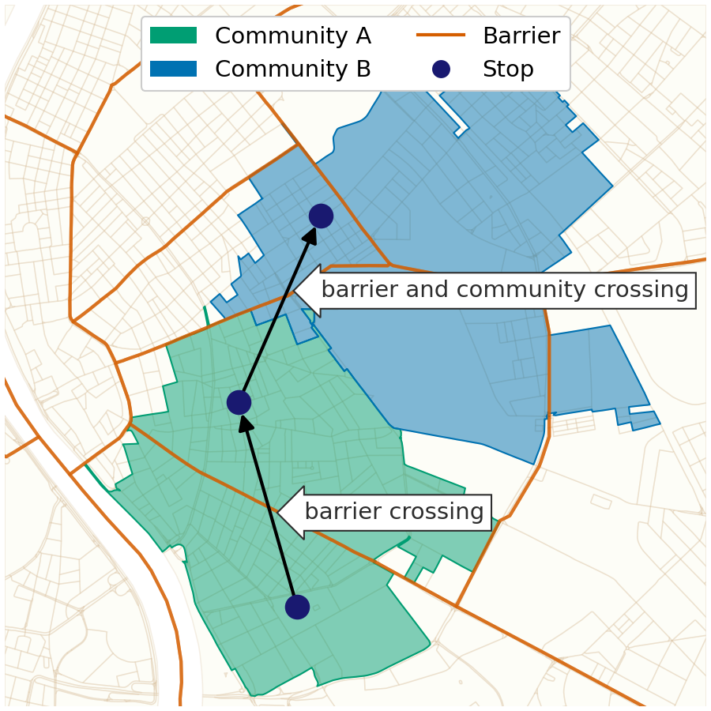
::::::
:::::::::
::::::::::::
:::::::::::: {.column width="50%"}
::::::::: {.r-stack}
:::::: {.fragment data-fragment-index=7 .current-visible}
\\[ BCR_{\gamma}^{barrier} = \dfrac{1}{n} \frac{ \sum_{m} \text{{CB}} }{ \sum_{m} \text{{CB}} \times \text{{CC}}_{\gamma} } \\]

::: {.text-smaller}
- *m* is the number of mobility edges
- $\gamma$ is the resolution
- *n* is the number of iterations at resolution $\gamma$
:::

by barrier types:

::: {.text-smaller}
- district
- neighborhood
- primary roads
- secondary
- railways
- river
:::
::::::
:::::::::
::::::::::::
:::::::::::::::

# thanks for the attention! {background-color="#181d37" .text-color-white background-image="assets/aneti_cub_white.svg" background-size="23vw" background-position="1.25rem calc(100% - 1.25rem)" .light-slide-number}
<!-- # thanks for the attention! {background-color="#181d37" .text-color-white background-size="23vw" background-position="1.25rem calc(100% - 1.25rem)"} -->

::: {.text-color-white}
Gergő Pintér, gergo.pinter&ThinSpace;&#64;&ThinSpace;uni-corvinus.hu, \@pintergreg[{.svg-invert}](https://twitter.com/pintergreg) [{.svg-invert}](https://github.com/pintergreg) [{.svg-invert}](https://bsky.app/profile/pintergreg.bsky.social)
:::

::::::::::::::: {.columns}
:::::::::::: {.column width="50%"}
this presentation is available online: [[pintergreg.github.io/ccs24](https://pintergreg.github.io/ccs24)]{.text-size-2 .anchor-color-lightblue}

::::::::::::
:::::::::::: {.column width="45%"}
preprint available:

[{width=350}](https://arxiv.org/abs/2312.11343)

::::::::::::
:::::::::::::::

# references {visibility=uncounted}

::: {#refs}
:::
