# {visibility=hidden}
::: {.r-fit-text}
all roads lead to Rome
:::

::: notes
- if we take that literately and kinda reverse it, we get that the roads lead where the romans wanted to go
- my point is, roads are built to connect places
:::

# motivation

:::::::::::::: {.columns}
::::::::: {.column width="30%"}
:::::: {.r-stack}
::: {}

:::
::: {.fragment data-fragment-index=1}

:::
::::::
:::::::::
::::::::: {.column width="80%"}
::: {.fragment data-fragment-index=1}
 via [Mapillary](https://www.mapillary.com/app/?lat=47.45252492224&lng=19.11784766168&z=17&pKey=1294650608077501&focus=photo) [CC BY-SA 4.0](https://creativecommons.org/licenses/by-sa/4.0/)](figures/vst_1294650608077501_20230915_cropped.jpg)
:::
:::::::::
::::::::::::::

::: notes
- So in a sense, a road has a power to bring places closer to each other.
- Maybe not in a way as an Eintein-Rosen bridge; blending the space.
- But at the same time, a road can have an orthogonal effect: separating places, thus separating people.
- The photo show a multilane road to illustrate my point.
- This particular road separates two neighborhood. I guess I can safely say that people do not really cross this unless they really have to.
- The duality of the transportation infrastructure is motivated out work.

<!-- - transportation infrastructure are built to connect places -->
<!-- - but the elements of this infrastructure can also separate neighborhoods -->
<!-- - especially if it is a wide, multilane road -->
<!-- - we can consider a road as a connecting and a separating element of the fabric of a city -->
<!-- - as if two orthogonal forces act regarding a road -->
:::

## amenities enter the equation

:::::::::::::: {.columns}
::::::::: {.column width="50%"}
:::::: {.r-stack}
::: {}
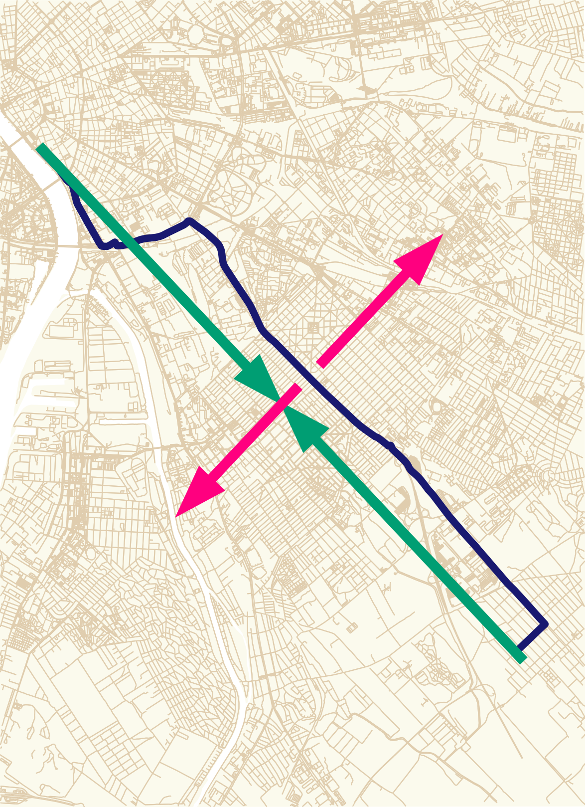{width=350}

:::
::: {.fragment data-fragment-index=1}
{width=350}

:::
::::::
:::::::::
::::::::: {.column width="50%" .mt-5}
- complex amenities foster social mixing [@juhasz2023amenity]
- complex as in economic complexity
- still working combining the two branches of research
:::::::::
::::::::::::::

::: notes
- I'm not gonna lie, the equation is not complete; amenities also influence the mobility
- amenities attract people and that attraction force could be strong enough to make people overcome any barriers
- for example, the workplace or an amenity with unique behavior
    - in an earlier work, we defined that uniqueness as complexity applying economic complexity to the urban mobility setting and also found that complex amenities foster social mixing
:::

## motivation {visibility=hidden}

:::::::::::::: {.columns}
::: {.column width="67%"}
 | [CC BY-SA 4.0](https://creativecommons.org/licenses/by-sa/4.0/)](figures/WildlifeCrossingRoad38IsraelOct092022_02.jpg){width=750}
:::
::::::::::::::

::: notes
- I like this photo, not just because it is beautiful, catchy to the eye, but because of the kindness of concept.
    - building 
- the barrier effect, the separating force 
- some bridges are built solely for the wildlife to overcome this issue
- in an urban scenario, even a crosswalk, especially with traffic lamps could help
:::

# mobile positioning data

:::::::::::::: {.columns}
::: {.column width="55%"}
{height=375}

:::
::: {.column width="45%" .text-smallerx .mt-3}
- collected from various, unspecified smartphone apps
    - timestamp, user ID, location
    - GPS-based location
- pings are clustered into stops [@juhasz2023amenity]
    - using [Infostop](https://github.com/ulfaslak/infostop) algorithm [@aslak2020infostop]
    - where some time was spent
:::
::::::::::::::

::: notes
- we have the mobility data collected and aggregated from various and unknown smartphone applications
- a record has a timestamp, a user ID and GPS location
- we have two years of data for the whole country
:::

## building a network

:::::::::::::: {.columns}
::: {.column width="50%"}

:::
::: {.column width="50%"}

:::
::::::::::::::

# community detection

:::::::::::::: {.columns}
:::::: {.column .center-content width="55%"}
- using the network built from the stops
- Louvain community detection is applied
    - with different resolution values
    - executed 10 times for each resolution
::::::
:::::: {.column width="45%"}

::::::
::::::::::::::

## Louvain community detection - resolution 2.5

:::::::::::::: {.columns}
:::::: {.column width="40%"}

::::::
:::::: {.column width="40%" .fragment}

::::::
::::::::::::::

# barrier crossing ratio

::::::::::::::: {.columns}
:::::::::::: {.column width="50%"}
::::::::: {.r-stack}
:::::: {}

::::::
:::::: {.fragment data-fragment-index=1}

::::::
:::::: {.fragment data-fragment-index=2}

::::::
:::::::::
::::::::::::
:::::::::::: {.column width="50%"}
::::::::: {.r-stack}
:::::: {.fragment data-fragment-index=7 .current-visible}
\\[ BCR_{\gamma}^{barrier} = \dfrac{1}{n} \frac{ \sum_{m} \text{{CB}} }{ \sum_{m} \text{{CB}} \times \text{{CC}}_{\gamma} } \\]

::: {.text-smaller}
- *m* is the number of mobility edges
- $\gamma$ is the resolution
- *n* is the number of iterations at resolution $\gamma$
:::

by barrier types:

::: {.text-smaller}
- district
- neighborhood
- primary roads
- secondary
- railways
- river
:::
::::::
:::::::::
::::::::::::
:::::::::::::::

::: notes
:::

## classify users based on home location

trips within Budapest are considered

::: {.fragment data-fragment-index=3}
but the classification is not restricted to Budapest
:::

:::::: {.r-stack}
::: { .mt-5 .current-visible}
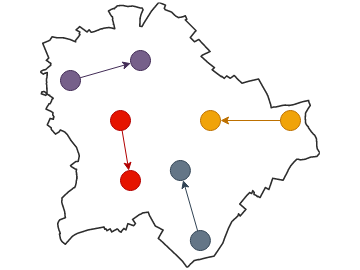{width=400}
:::
::: {.fragment data-fragment-index=3 .mt-5 .current-visible}
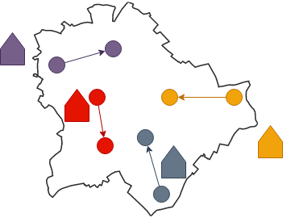{width=400}
:::
::::::

## decomposing barrier crossing ratio

:::::::::::::: {.columns}
:::::: {.column width="30%"}
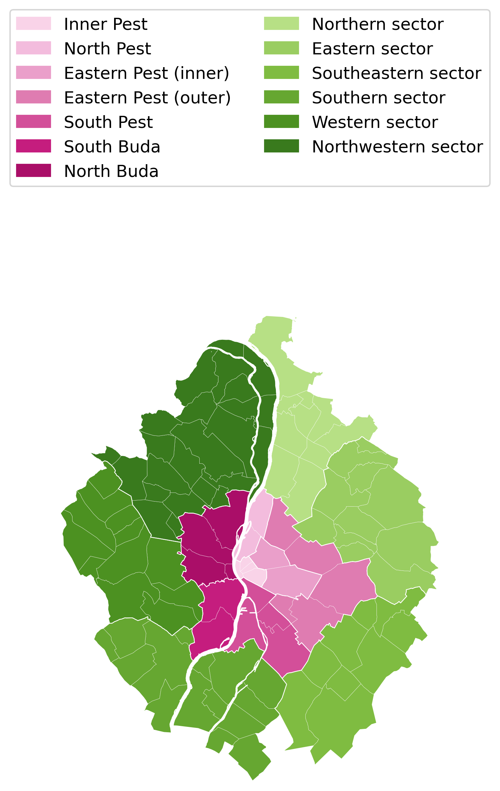

::::::
:::::: {.column width="70%" .fragment}
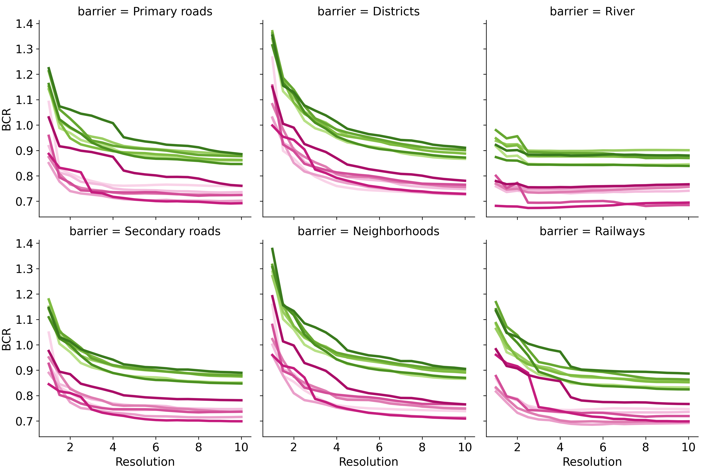

::::::
::::::::::::::

## decomposing barrier crossing ratio

:::::::::::::: {.columns}
:::::: {.column width="30%"}
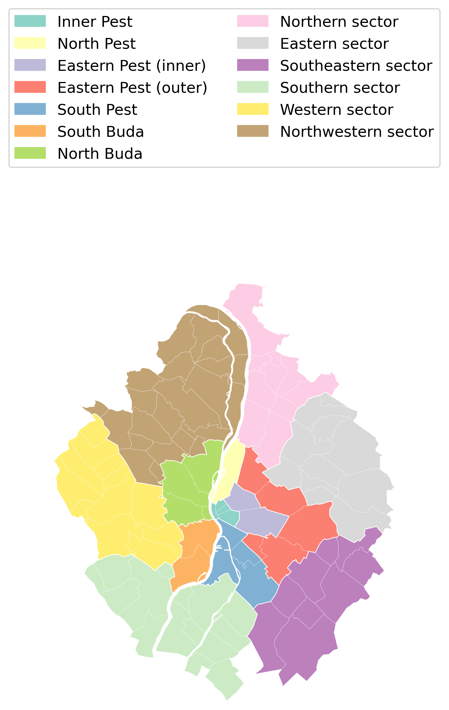

::::::
:::::: {.column width="70%"}
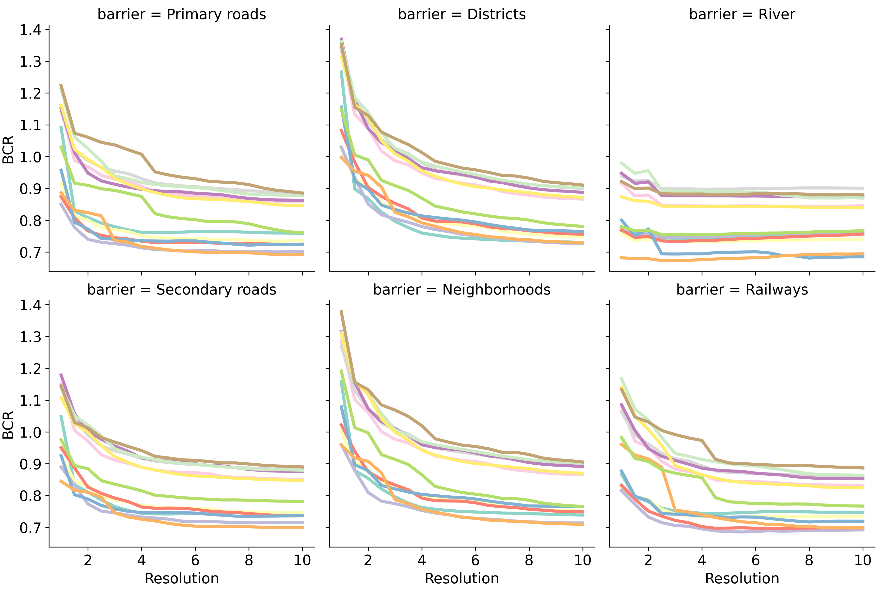

::::::
::::::::::::::

## back to amenities

::: {}
$$ log BCR_{\gamma, n}^{c} = \alpha + \beta_1\log{D_c} + \beta_2\log{AC_j} + \epsilon $$

::: {.text-smaller}
$AC_j$ complexity of amenity portfolio of the visited $j$ location as proposed by [@juhasz2023amenity]

:::
:::

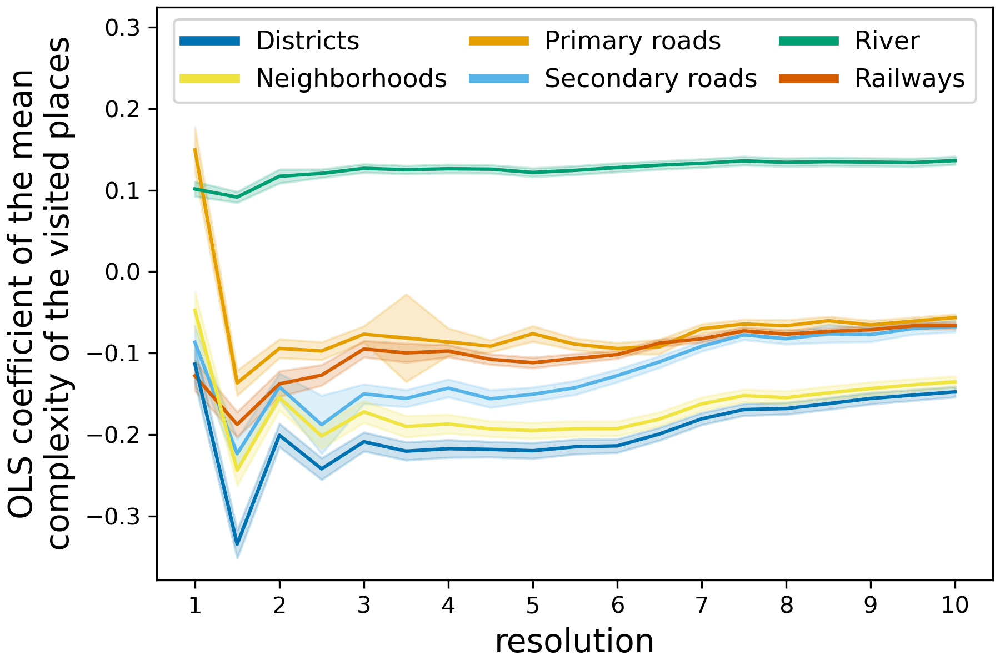{width=600}

# Nagoya metropolitan area

:::::::::::::: {.columns}
:::::: {.column width="50%"}
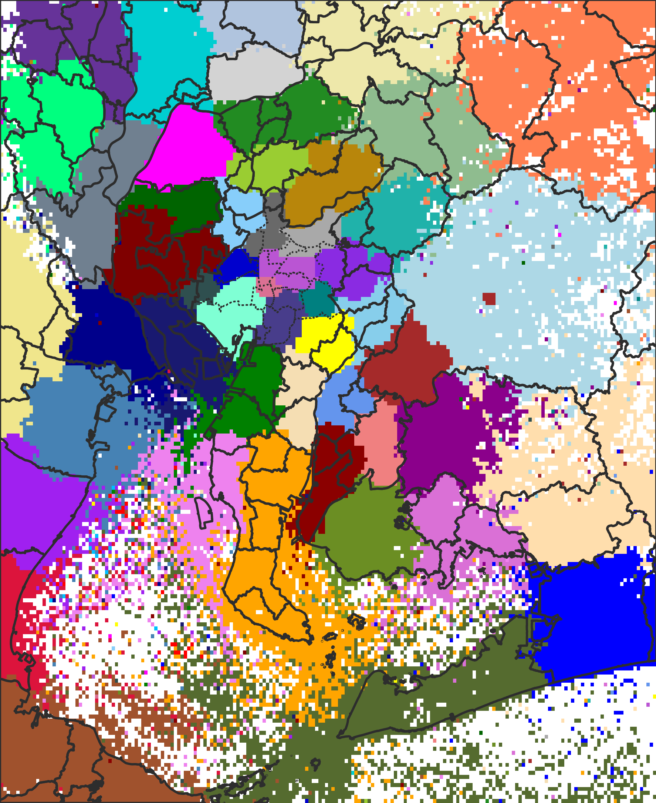{width=335}
::::::
:::::: {.column width="50%" .fragment}
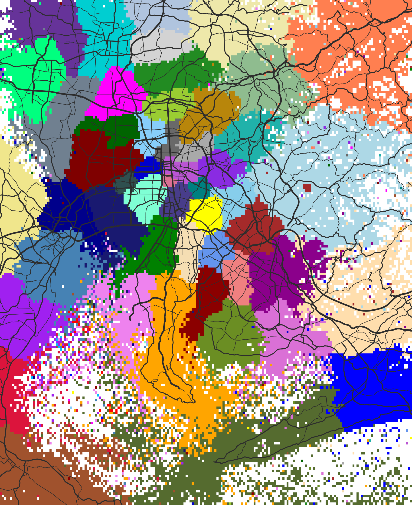{width=335}
::::::
::::::::::::::

::: {.text-smaller}
open data (YJMob100K): [@yabe2024yjmob100k] | preprocessing (preprint): [@pinter2024revealing]
:::

::: notes
- I replicated this using another data set about the Nagoya metropolitan, which follows 100.000 people in a 100 km by 100 km metropolitan area
- we can see that Louvain communities align with the municipality boundaries pretty well, though sometimes multiple municipalities form a community just as we saw it in the case of Budapest
- what does not align at all is the road network, which is a huge difference between the Budapest and the Japanese results
:::

## BCR × Nagoya

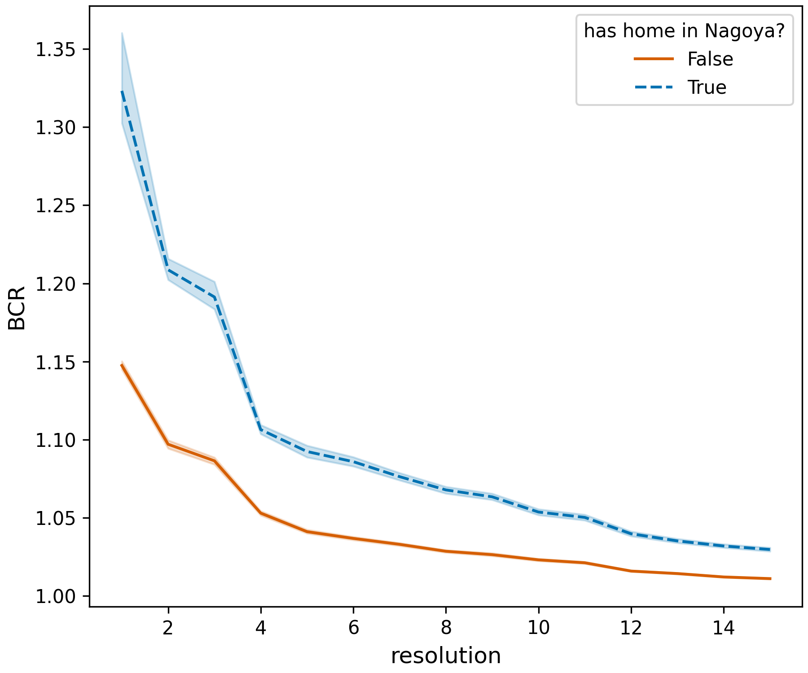{width=650}

::: notes
- I also calculated the individual barrier crossing ratio for the Japanese data
- the trends are the same, but that's the less interesting
- I wanted to replicate the experiment distinguishing the people by residence, so I formed two categories, people having home in and out of Nagoya
- however, the barrier effect is just the opposite compared to Budapest regarding Nagoya dwellers and others
- it still needs more study to completely understand the reason of this; my educated guess is that the different transportation culture leads to the different community alignments, which cases the opposite relation in the BCR
:::

#

:::::::::::::: {.columns}
:::::: {.column width="50%"}
**takaway**

- there is a barrier effect 
- which affects people differently based on background

::::::
:::::: {.column width="50%"}
**future work**

- socio-economic status
- different time interval
    - workdays - weekends
    - time of the day

::::::
::::::::::::::

# thanks for the attention! {background-color="#181d37" .text-color-white background-image="assets/by.svg" background-size="10vw" background-position="1.25rem calc(100% - 1.25rem)" .light-slide-number}

::: {.text-color-white}
Gergő Pintér, gergo.pinter&ThinSpace;&#64;&ThinSpace;uni-corvinus.hu, \@pintergreg[{.svg-invert}](https://twitter.com/pintergreg) [{.svg-invert}](https://github.com/pintergreg) [{.svg-invert}](https://bsky.app/profile/pintergreg.bsky.social)
:::

::::::::::::::: {.columns}
:::::::::::: {.column width="50%"}
this presentation is available online: [[pintergreg.github.io/ccs24](https://pintergreg.github.io/ccs24)]{.text-size-2 .anchor-color-lightblue}

we are looking for contributors with compatible data

::::::::::::
:::::::::::: {.column width="45%"}
already available on [[arXiv](https://arxiv.org/abs/2312.11343)]{.anchor-color-lightblue}: 2312.11343

[{width=350}](https://arxiv.org/abs/2312.11343)

::::::::::::
:::::::::::::::

# references {visibility=uncounted}

::: {#refs}
:::
