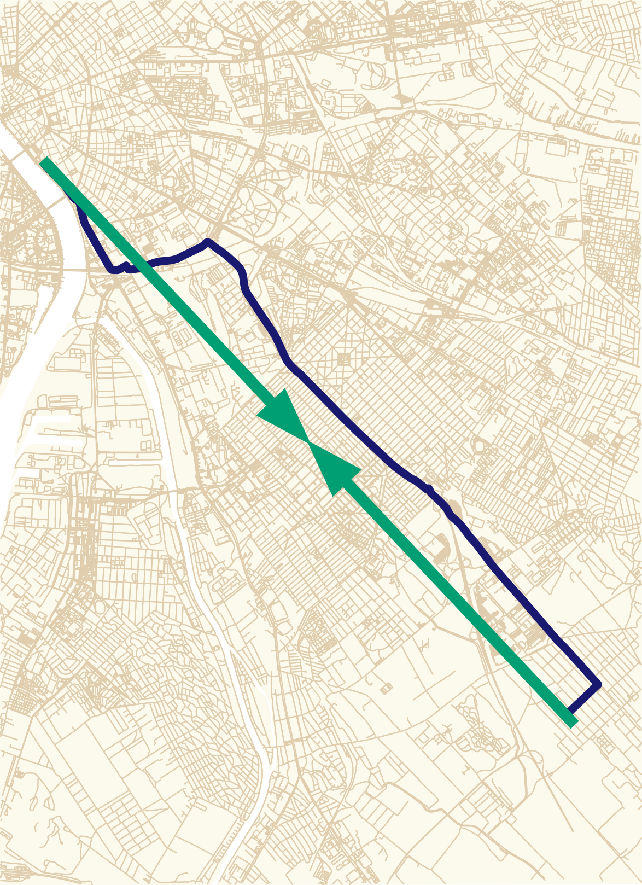
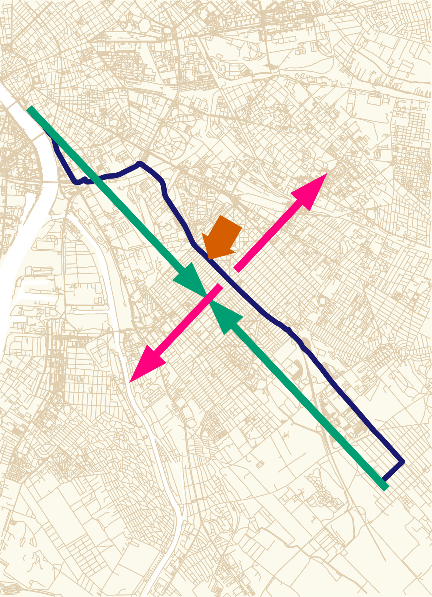
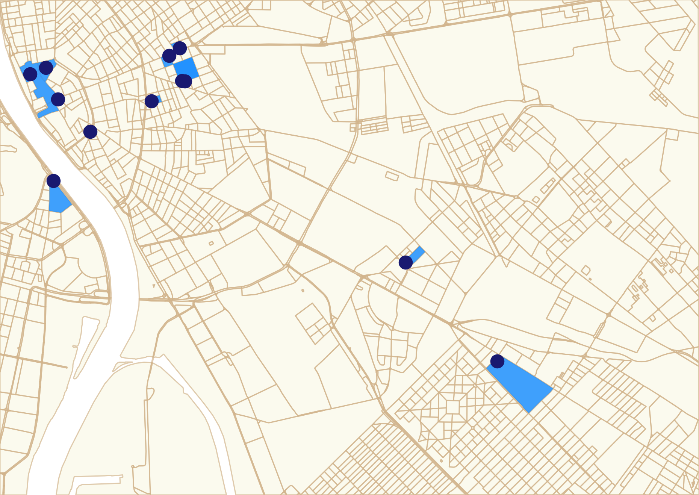
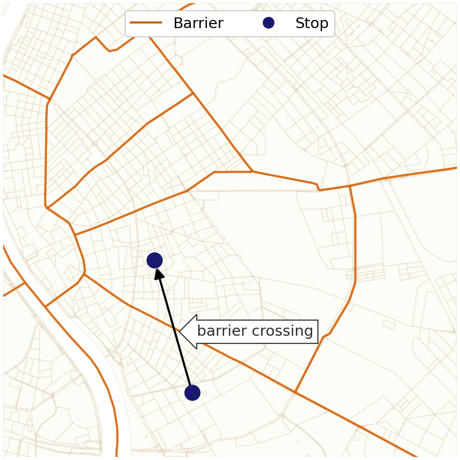
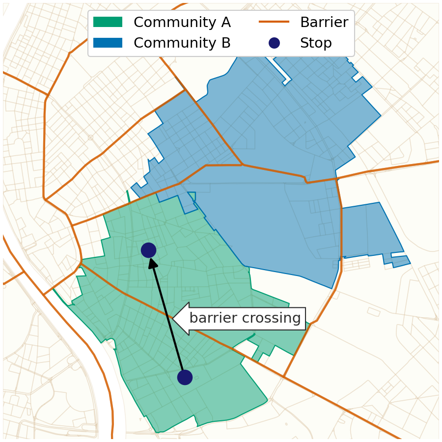
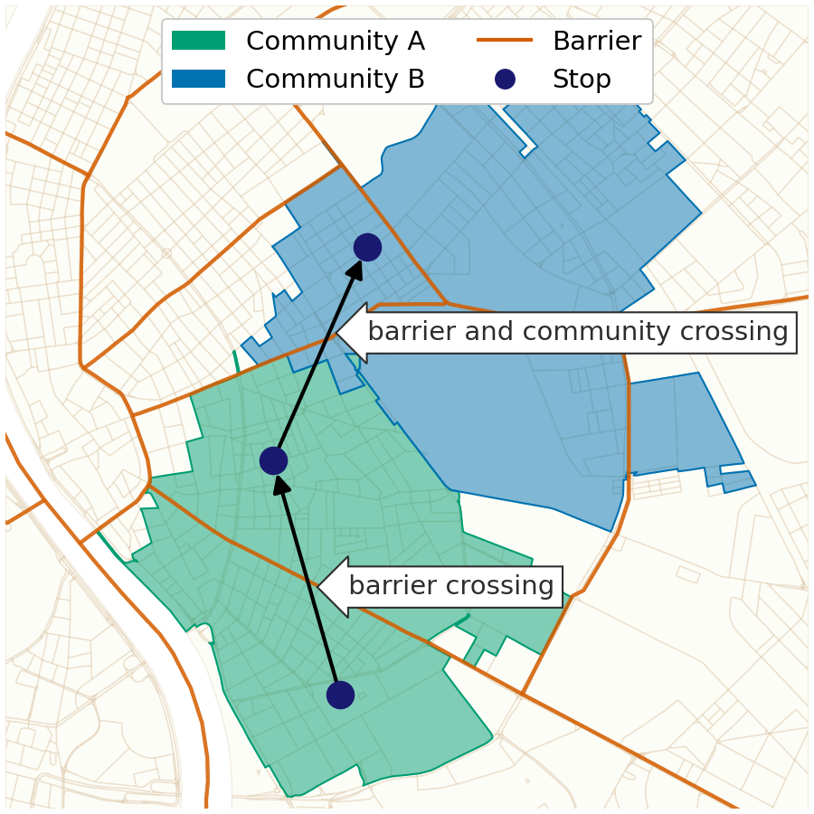
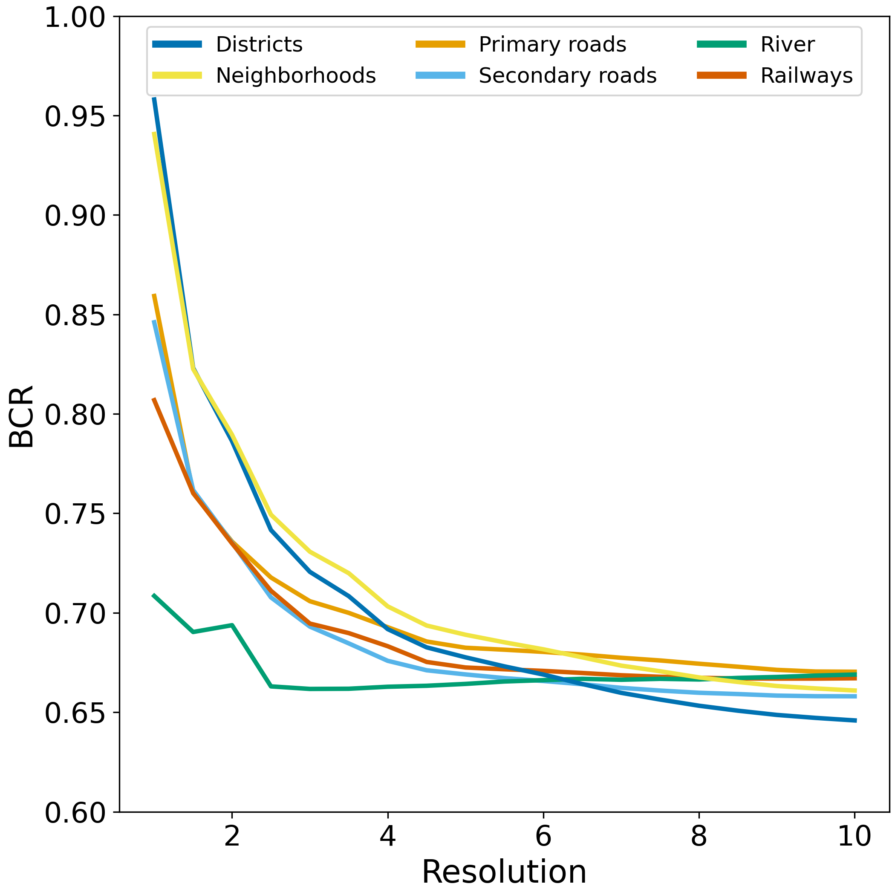
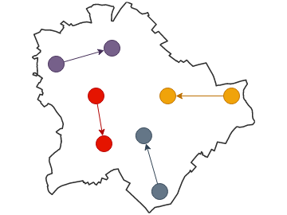
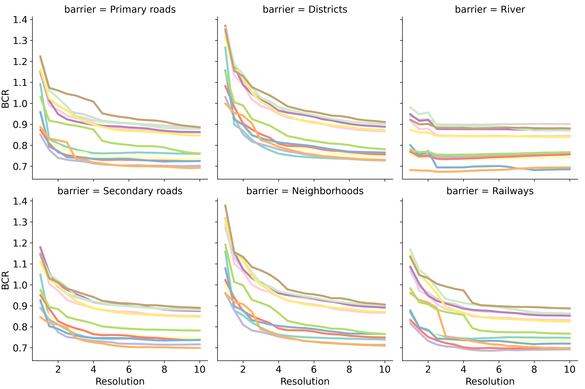

# motivation

:::::::::::::: {.columns}
::::::::: {.column width="30%"}
:::::: {.r-stack}
::: {}

:::
::: {.fragment data-fragment-index=1}

:::
::::::
:::::::::
::::::::: {.column width="80%"}
::: {.fragment data-fragment-index=1}
 via [Mapillary](https://www.mapillary.com/app/?lat=47.45252492224&lng=19.11784766168&z=17&pKey=1294650608077501&focus=photo) [CC BY-SA 4.0](https://creativecommons.org/licenses/by-sa/4.0/)](figures/vst_1294650608077501_20230915_cropped.jpg)
:::
:::::::::
::::::::::::::

::: notes
- So in a sense, a road has a power to bring places closer to each other.
- Maybe not in a way as an Eintein-Rosen bridge; blending the space.
- But at the same time, a road can have an orthogonal effect: separating places, thus separating people.
- The photo show a multilane road to illustrate my point.
- This particular road separates two neighborhood. I guess I can safely say that people do not really cross this unless they really have to.
- The duality of the transportation infrastructure is motivated out work.
:::

# mobile positioning data

:::::::::::::: {.columns}
::: {.column width="55%"}
{height=375}

:::
::: {.column width="45%" .text-smallerx .mt-3}
- collected from various, unspecified smartphone apps
    - timestamp, user ID, location
    - GPS-based location
- pings are clustered into stops [@juhasz2023amenity]
    - using [Infostop](https://github.com/ulfaslak/infostop) algorithm [@aslak2020infostop]
    - where some time was spent
:::
::::::::::::::

::: notes
- we have the mobility data collected and aggregated from various and unknown smartphone applications
- a record has a timestamp, a user ID and GPS location
- we have two years of data for the whole country
:::

## building a network

:::::::::::::: {.columns}
::: {.column width="50%"}

:::
::: {.column width="50%"}

:::
::::::::::::::

# community detection

:::::::::::::: {.columns}
:::::: {.column .center-content width="55%"}
- using the network built from the stops
- Louvain community detection is applied
    - with different resolution values
    - executed 10 times for each resolution
::::::
:::::: {.column width="45%"}

::::::
::::::::::::::

## Louvain community detection - resolution 2.5

:::::::::::::: {.columns}
:::::: {.column width="40%"}

::::::
:::::: {.column width="40%" .fragment}

::::::
::::::::::::::

# barrier crossing ratio

::::::::::::::: {.columns}
:::::::::::: {.column width="50%"}
::::::::: {.r-stack}
:::::: {}

::::::
:::::: {.fragment data-fragment-index=1}

::::::
:::::: {.fragment data-fragment-index=2}

::::::
:::::::::
::::::::::::
:::::::::::: {.column width="50%"}
::::::::: {.r-stack}
:::::: {.fragment data-fragment-index=7 .current-visible}
\\[ BCR_{\gamma}^{barrier} = \dfrac{1}{n} \frac{ \sum_{m} \text{{CB}} }{ \sum_{m} \text{{CB}} \times \text{{CC}}_{\gamma} } \\]

::: {.text-smaller}
- *m* is the number of mobility edges
- $\gamma$ is the resolution
- *n* is the number of iterations at resolution $\gamma$
:::

by barrier types:

::: {.text-smaller}
- district
- neighborhood
- primary roads
- secondary
- railways
- river
:::
::::::
:::::::::
::::::::::::
:::::::::::::::

::: notes
:::

## BCR by barrier types

{width=500}

## classify users based on home location

trips within Budapest are considered

::: {.fragment data-fragment-index=3}
but the classification is not restricted to Budapest
:::

:::::: {.r-stack}
::: { .mt-5 .current-visible}
{width=400}
:::
::: {.fragment data-fragment-index=3 .mt-5 .current-visible}
{width=400}
:::
::::::

## decomposing barrier crossing ratio

:::::::::::::: {.columns}
:::::: {.column width="30%"}

::::::
:::::: {.column width="70%" .fragment}

::::::
::::::::::::::

## decomposing barrier crossing ratio {visibility=hidden}

:::::::::::::: {.columns}
:::::: {.column width="30%"}

::::::
:::::: {.column width="70%"}

::::::
::::::::::::::

# thanks for the attention! {background-color="#181d37" .text-color-white background-image="assets/by.svg" background-size="10vw" background-position="1.25rem calc(100% - 1.25rem)" .light-slide-number}

::: {.text-color-white}
Gergő Pintér, gergo.pinter&ThinSpace;&#64;&ThinSpace;uni-corvinus.hu, \@pintergreg[{.svg-invert}](https://twitter.com/pintergreg) [{.svg-invert}](https://github.com/pintergreg) [{.svg-invert}](https://bsky.app/profile/pintergreg.bsky.social)
:::

::::::::::::::: {.columns}
:::::::::::: {.column width="50%"}
this presentation is available online: [[pintergreg.github.io/ccs24/short](https://pintergreg.github.io/ccs24/short)]{.text-size-2 .anchor-color-lightblue}

:::::: {.mt-5}
references

::: {#refs .text-size-1}
:::

::::::

::::::::::::
:::::::::::: {.column width="45%"}
already available on arXiv: [[2312.11343](https://arxiv.org/abs/2312.11343)]{.anchor-color-lightblue}

[{width=350}](https://arxiv.org/abs/2312.11343)

::::::::::::
:::::::::::::::
